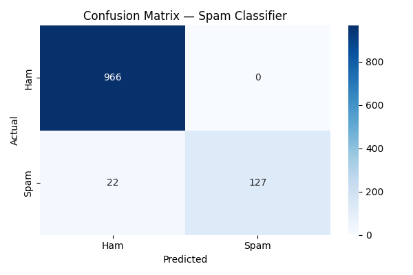

# Text Classifier — Spam / Not Spam

A Machine Learning project that classifies SMS messages as Spam or Ham
using Naive Bayes and TF-IDF Vectorization.

## Tech Stack
- Python
- scikit-learn
- pandas
- NLTK
- matplotlib / seaborn

## Project Steps
- Step 1 — Load Dataset (5572 SMS messages)
- Step 2 — Clean Text (lowercase, stopwords, tokenize)
- Step 3 — TF-IDF Vectorization (text to numbers)
- Step 4 — Train Naive Bayes Model
- Step 5 — Evaluate (Accuracy, Precision, Recall, F1)

## Results
| Metric | Score |
|--------|-------|
| Accuracy | 98.03% |
| Precision | 100% |
| Recall | 85% |
| F1 Score | 92% |

## Confusion Matrix

## Dataset
SMS Spam Collection Dataset — UCI Machine Learning Repository
5572 messages — 4825 Ham, 747 Spam